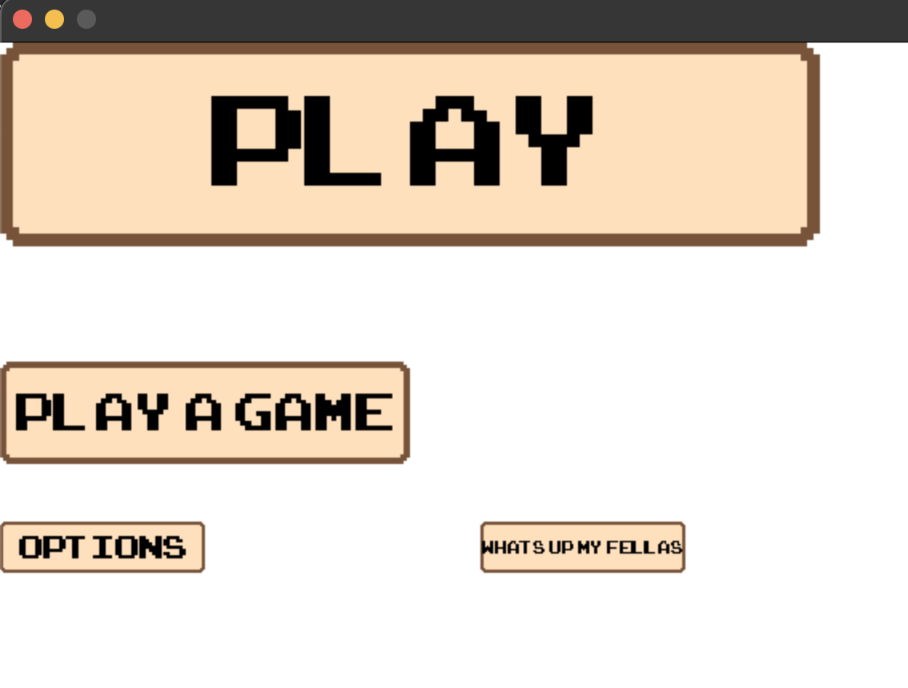

# Pygame-Utilities

This project is about developing my own python module 'PygUtilities' which will be a package of pygame objects created on my own.
The purpose of creating this small 'extension' is to make my future pygame projects easier to develop and keep code clean.

## Module content ##
(So far) module contains fully functional and flexible:
- **Status Bars**
- **Blank Pop-up Tables**
- **Text Buttons**
- **Check Boxes**

<p float="left">
  
   
  
  
</p>

## HOW TO USE ##
Python files in PygUtilities directory are just class files so in order to use this 'module' please locate 'PygUtilities' directory in the same location as 'main.py' file.

## DOCUMENTATION FOR EVERY CLASS ##
#### STATUS BARS ### 
What should be written in your main.py file to display basic red bar hud:
```python
import pygame
from PygUtilities.bar import Bar

pygame.init()

window = pygame.display.set_mode((1280, 720))

bar = Bar(0,0, 48*6, 16*6, cap=100, name='ST', color=(51, 102, 255), scale=6)

if __name__=='__main__':
    run = True

    while run:
        for event in pygame.event.get():
            if event.type == pygame.QUIT:
                run = False
        
        bar.draw(window)
        pygame.display.update()
    
    pygame.quit()
```

class Bar arguments:

          *args (same as Rect class from pygame): (position_x of upper-left corner of HUD, position_y of upper-left corner of HUD,
                  width of HUD, height of HUD)
                  
          **kwargs: (cap - (INTEGER) the maximum value of points in status bar, 
          name - (STRING) two first letters will be displaying as HUD name,
          color - (RGB: 3-element tuple or hex code) color of status bar,
          scale - (FLOAT) it sets size of HUD in this specific way (48*scale, 16*scale)

class Bar methods:
```
          .draw(window) - takes surface as argument and displays Bar HUD on it
          .change_value(change) - takes signed integer which is added to current value of status, 
          this method also updates length of bar to be propotional to (current_value/cap_calue) fraction 
```

#### Pop-up Table ### 
To display:
```python
from PygUtilities.popup import Popup


pygame.init()
window = pygame.display.set_mode((1280, 720))

popup = Popup(0,0, 100, 100)

if __name__=='__main__':
  run = True
  while run:
    for event in pygame.event.get():
      if event.type == pygame.QUIT:
        run = False
      if event.key == pygame.K_e:
        popup1.change_status()
      
      popup.draw(window)
      pygame.display.update()
    
  pygame.quit()
```
This specific code displays popup window after you click 'E' key.

class Popup takes same arguments as Rect class which is part of pygame module.

class Popup methods:
```
      .draw(window) - takes surface as argument and displays Popup if its status is opened.
      .clicked(mouse_pos) - takes tuple with 2 integer elements, which should be current mouse position. 
      If the Popup table is opened this method takes action which depends on clicked content.
      .change_status() - takes no arguments and and changes status of popup, which mean:
      -if it was closed, now opens up 
      -if it was opened, now closes down
```

### WORK IN PROGRESS ###
I'm still writing missing part of docs.

#### DISCLAIMER ####
I'm not author of the font which I'm using in this project, it comes from [this site](https://www.1001fonts.com/arcadeclassic-font.html)
